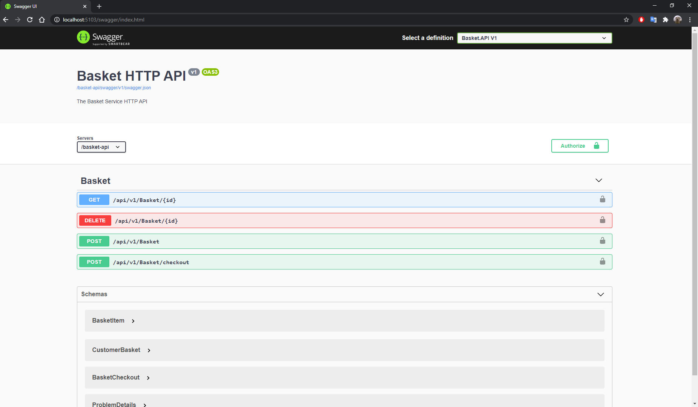
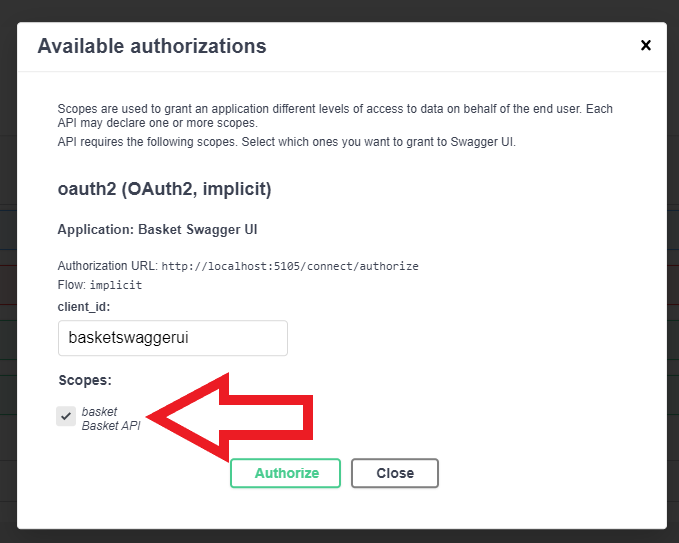
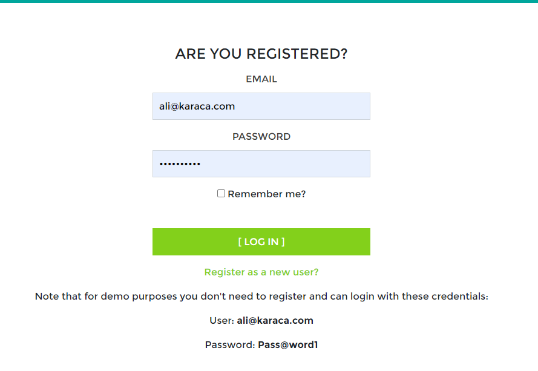
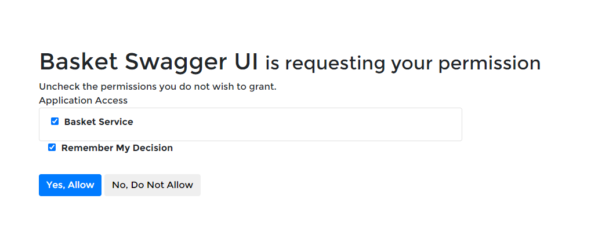
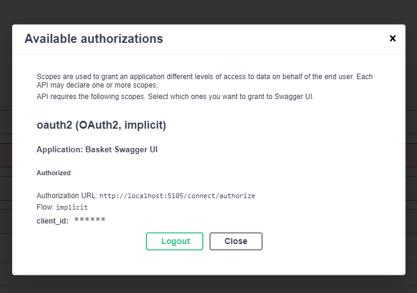

This project is an example ecommerce application based on microservice architecture and runs in docker.

Basket and Identity apis implemented. Docker with linux containers required to run.

You can run the project with visual studio(f5 experience) or running docker-compose up command in "src" folder.

Sometimes sql server/rabbitmq may fail to connect. If it happens, ignore and continue to debug, there is a retry mechanism involved.

After running the project:

- Navigate: http://localhost:5103/swagger/index.html
  

- Click Authorize

- Select "basket - basketAPI" scope and click "Authorize". If you don't select a scope auth will fail.
  

- Use following email and password:

        email:      ali@karaca.com
        password:   Pass@word1

  

- Allow permissions
  
- Now you are logged in, you can use swagger ui.
  
